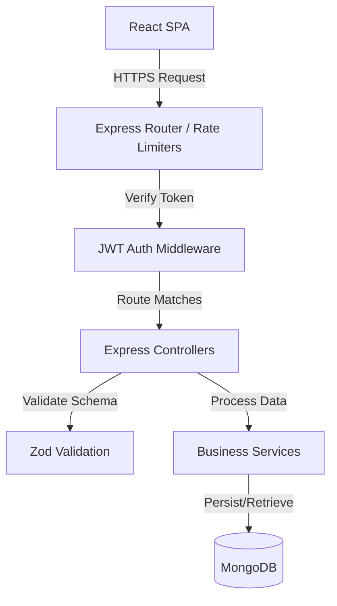
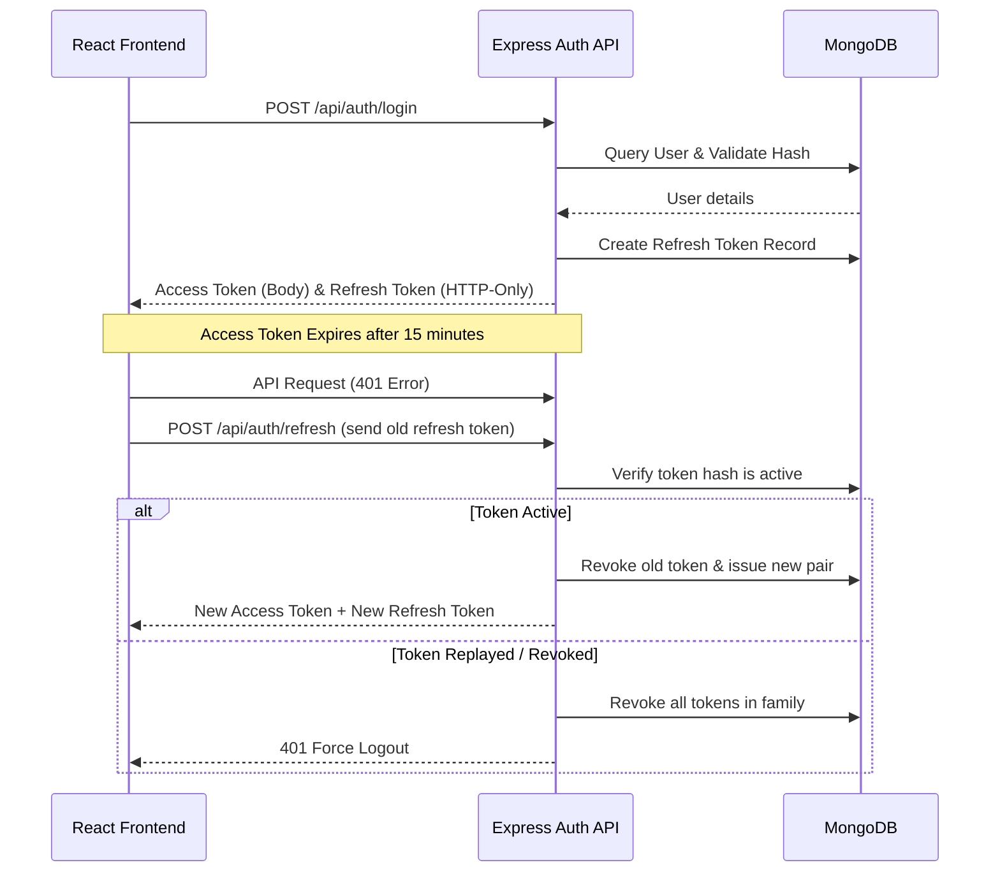
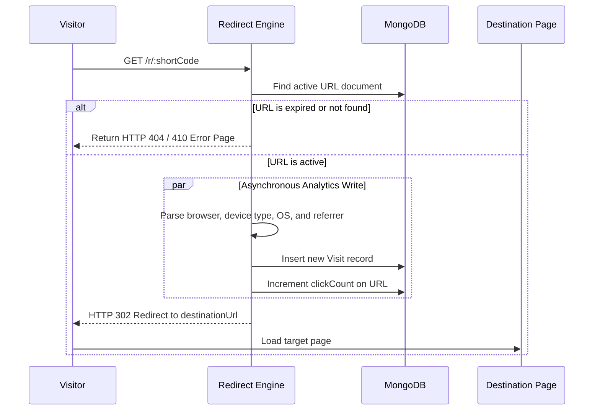

# ⚡ Lynko — Premium Retro-Brutalist URL Shortener & Analytics Platform

```
   __          __   _  __  ____  
  / /   _  __ / /_ / |/ / / __ \ 
 / /__ / // // __//    // /_/ / 
/____/ \_, //_/  /_/|_/ \____/  
      /___/                     
```

Lynko is an enterprise-grade, full-stack URL shortening and traffic intelligence platform. Merging a sleek modern retro-brutalist aesthetic (deep green accents, crisp solid offsets, card borders, and fluid animations) with advanced security controls and rich analytic breakdowns, Lynko elevates simple redirections into comprehensive visitor telemetry.

---

## 🌐 Production Deployments
- **Frontend App (Vercel)**: [https://lynko-three.vercel.app](https://lynko-three.vercel.app)
- **Backend API (Render)**: [https://lynko-9867.onrender.com](https://lynko-9867.onrender.com)

---

## 💡 Problem Statement & Motivation
In digital marketing, brand distribution, and public analytics sharing, modern users need more than just link condensation. They require:
- **Comprehensive security** against token theft and link hijacking.
- **Granular, human-friendly telemetry** (device profiles, daily click trends, geographic locations, and referrer sources) without relying on invasive external tracking platforms.
- **Bulk shortening capacity** for massive outreach campaigns.
- **Brand consistency** through customizable aliases and QR code rendering.

Lynko was engineered to address these challenges, offering a fully self-hosted, scalable, REST-powered architecture with real-time analytics aggregation.

---

## ✨ Features

### 📋 Feature Checklist

| Category | Feature | Status | Details |
| :--- | :--- | :---: | :--- |
| **Mandatory** | User Signup & Login | ✅ | Secure registration and login with bcrypt hashing. |
| **Mandatory** | Protected Dashboard Routes | ✅ | React Router gates redirecting unauthorized users. |
| **Mandatory** | Scoped Owner Control | ✅ | Users can only view, edit, or delete links they created. |
| **Mandatory** | URL Shortening & Expiry | ✅ | Sanity input validation with dynamic expiration handling. |
| **Mandatory** | Server-Side Redirection | ✅ | Custom Express route resolving links and logging visits. |
| **Mandatory** | Responsive UI | ✅ | Optimized layouts across mobile, tablet, and desktop viewports. |
| **Mandatory** | Interactive Analytics | ✅ | Comprehensive click count tracking and visit history logs. |
| **Bonus** | Custom Alias | ✅ | Unique custom paths (e.g., `/r/special-promo`). |
| **Bonus** | QR Code Generation | ✅ | Auto-generated downloadable QR codes for every link. |
| **Bonus** | Expiry Date Purging | ✅ | Automatic MongoDB TTL self-cleaning background indices. |
| **Bonus** | Device & Browser Charts | ✅ | Breakdown graphs showing visitor browser, OS, and device types. |
| **Bonus** | Daily Click Trends | ✅ | Time-series charts mapping traffic over a selected period. |
| **Bonus** | Public Stats Page | ✅ | Non-sensitive, shareable page showcasing link traffic curves. |
| **Bonus** | Destination URL Editing | ✅ | Live updating of existing shortcode redirection targets. |
| **Bonus** | Bulk CSV Upload | ✅ | PapaParse-assisted multi-link CSV import widget. |
| **Bonus** | Traffic Quality Analytics | ✅ | Automatic classification of hits (Human, Bot, Suspicious). |
| **Bonus** | Referrer & UTM Tracker | ✅ | Logs source platform metrics (LinkedIn, Twitter, Google, etc.). |

---

## 🛠️ Tech Stack

### Frontend
- **Framework**: React 18+ (Vite-powered SPA)
- **Styling**: Vanilla CSS + TailwindCSS (Brutalist styling primitives)
- **Charts**: Recharts (Dynamic vector analytics graphing)
- **Animations**: Framer Motion (Transitions, modals, state shifts)
- **CSV Parser**: PapaParse (Chunked browser-side file scanning)
- **Icons**: Lucide React

### Backend
- **Platform**: Node.js & Express
- **Validation**: Zod (Type-safe input sanitization schemas)
- **Authentication**: JSON Web Tokens (JWT) + bcrypt (12 rounds)
- **User Agent Parser**: UAParser.js (Browser, OS, device modeling)

### Database & Security
- **Store**: MongoDB & Mongoose ODM
- **Index Management**: Compound search indices and TTL auto-expirations
- **Rate Limiting**: Express Rate Limit (Auth endpoint defense)

---

## 🏛️ Architecture Overview

```
Client (React SPA) ──[HTTPS]──> Express Router ──> Controllers ──> Services ──> MongoDB (Mongoose)
```

1. **Frontend Architecture**: Enforces centralized state control using `AuthContext.jsx` which contains automatic Axios request/response interceptors to catch `401 Unauthorized` responses and initiate Refresh Token Rotation (RTR) silently.
2. **Backend Architecture**: Follows a layered pattern: **Routes** (endpoints/limits) ➡️ **Controllers** (HTTP mapping & input parsing) ➡️ **Services** (business operations, database transactions, audit logging) ➡️ **Models** (Database schemas).
3. **Redirection Logic**: Handled server-side. Hits trigger `GET /r/:shortCode` where statistics parsing runs asynchronously to keep redirection speed instantaneous.

---

## 📊 System Sequence Flows

### 1. High-Level Architecture Diagram


### 2. Authentication (RTR) Flow


### 3. Redirection & Analytics Processing Flow


---

## 🗄️ Database Schemas & Relationships

### 1. User Schema (`User`)
Stores account credentials. Password hashes are excluded from defaults to prevent accidental leaks.
*   `email` (String, Unique, Lowercase, Indexed)
*   `passwordHash` (String, Select: False)
*   `role` (String, Enum: `["user", "admin"]`)
*   `isActive` (Boolean)
*   `lastLoginAt` (Date)

### 2. URL Schema (`Url`)
Holds redirection details.
*   `ownerId` (ObjectId ➡️ references `User`, Indexed)
*   `originalUrl` (String)
*   `shortCode` (String, Unique, Indexed)
*   `clickCount` (Number, Indexed for sorting)
*   `expiresAt` (Date, TTL auto-purge index)
*   `platforms` (Array of Strings)

### 3. Visit Schema (`Visit`)
Documents redirection telemetry.
*   `urlId` (ObjectId ➡️ references `Url`, Indexed)
*   `timestamp` (Date, Indexed)
*   `browser` (String)
*   `device` (String)
*   `operatingSystem` (String)
*   `ipAddress` (String)
*   `country` (String, Indexed)
*   `referrer` (String, Indexed)
*   `clickQuality` (String, Enum: `["human", "bot", "suspicious"]`)

### 4. Refresh Token Schema (`RefreshToken`)
Maintains cryptographic records for token rotation.
*   `userId` (ObjectId ➡️ references `User`)
*   `tokenHash` (String, Indexed)
*   `familyId` (String, UUID)
*   `revokedAt` (Date)
*   `expiresAt` (Date, TTL Auto-purge)

---

## 📂 Folder Structure

```
Lynko/
├── backend/
│   ├── config/             # DB and Env initializers
│   ├── controllers/        # Express route handlers
│   ├── middleware/         # Auth, validation and rate limit guards
│   ├── model/              # MongoDB Mongoose schemas
│   ├── routes/             # API routes definition
│   ├── services/           # Core database transactions & calculations
│   ├── utils/              # Token helpers, time parsers, logger
│   └── validators/         # Input sanitization via Zod schemas
└── frontend/
    ├── src/
    │   ├── api/            # API integration & interceptors
    │   ├── assets/         # Page illustrations and assets
    │   ├── components/     # UI primitives, loaders, navbars, sidebars
    │   ├── context/        # Global Auth providers
    │   ├── layouts/        # Layout frameworks (Dashboard shell)
    │   ├── pages/          # Core pages (Dashboard, Analytics, Bulk, etc.)
    │   ├── routes/         # Router configuration & path config
    │   └── utils/          # Formatting helpers and local storage utilities
```

---

## ⚙️ Environment Variables

### Backend (`backend/.env`)
| Variable | Required | Description |
| :--- | :---: | :--- |
| `PORT` | Yes | Port number to run the Express API (Default: `4000`). |
| `MONGODB_URI` | Yes | Connection string to MongoDB instance. |
| `JWT_ACCESS_SECRET` | Yes | Secret signature string for signing short-lived access tokens. |
| `JWT_ACCESS_EXPIRES_IN` | Yes | Expiry duration for access token (e.g., `15m`). |
| `JWT_REFRESH_SECRET` | Yes | Secret signature string for signing refresh tokens. |
| `JWT_REFRESH_EXPIRES_IN`| Yes | Expiry duration for refresh token (e.g., `7d`). |
| `RESET_TOKEN_EXPIRES_IN`| Yes | Expiry duration for password reset tokens (e.g., `15m`). |
| `FRONTEND_URL` | Yes | Allowed client web origin for CORS policies (e.g., `http://localhost:5173`). |
| `SAFE_BROWSING_API_KEY`| No | API key to perform Google Safe Browsing checks. |
| `VIRUSTOTAL_API_KEY` | No | API key to perform VirusTotal destination threat scans. |

### Frontend (`frontend/.env`)
| Variable | Required | Description |
| :--- | :---: | :--- |
| `VITE_API_URL` | Yes | Base URL target pointing to the backend API endpoint. |

---

## 🚀 Local Development Setup

### 1. MongoDB Setup
Ensure you have MongoDB running locally:
```bash
mongod --dbpath /your/db/path
```

### 2. Backend Installation & Start
Navigate to the `backend/` directory, install packages, and boot the server:
```bash
cd backend
npm install
# Create a .env file based on the Environment Variables section
npm run dev
```

### 3. Frontend Installation & Start
Open a separate terminal window, install packages, and boot the Vite server:
```bash
cd frontend
npm install
# Create a .env file and set VITE_API_URL
npm run dev
```

---

## 🔌 API Route Reference

### 🔐 Auth Endpoints
| HTTP Method | Route | Auth Required | Description |
| :--- | :--- | :---: | :--- |
| `POST` | `/api/auth/signup` | No | Creates a user account and returns token pairs. |
| `POST` | `/api/auth/login` | No | Validates password and generates auth sessions. |
| `POST` | `/api/auth/refresh` | No | Exchanges refresh token for rotated token sets. |
| `POST` | `/api/auth/logout` | No | Invalidates and revokes the active session token. |
| `POST` | `/api/auth/forgot-password`| No | Dispatches password reset code token. |
| `POST` | `/api/auth/reset-password` | No | Validates reset token and applies a new password. |

### 🔗 Link Management Endpoints
| HTTP Method | Route | Auth Required | Description |
| :--- | :--- | :---: | :--- |
| `POST` | `/api/urls` | Yes | Shortens a URL (optional: expiry date, custom alias). |
| `GET` | `/api/urls` | Yes | Lists all short URLs owned by the caller. |
| `GET` | `/api/urls/:id` | Yes | Retrieves full metadata details of a link. |
| `PATCH` | `/api/urls/:id` | Yes | Edits destination target or changes link expiration. |
| `DELETE` | `/api/urls/:id` | Yes | Purges the link from database records. |
| `POST` | `/api/urls/bulk` | Yes | Bulk uploads links from parsed CSV structures. |

### 📊 Real-Time Analytics Endpoints
| HTTP Method | Route | Auth Required | Description |
| :--- | :--- | :---: | :--- |
| `GET` | `/api/urls/:id/analytics`| Yes | Returns total clicks, last visit time, and summary maps. |
| `GET` | `/api/urls/:id/visits` | Yes | Paginated table logs of individual redirection visits. |
| `GET` | `/api/urls/:id/browsers` | Yes | Breakdown counts of visitor browser clients. |
| `GET` | `/api/urls/:id/devices` | Yes | Breakdown counts of device profile distributions. |
| `GET` | `/api/urls/:id/trends` | Yes | Time-series metrics mapping click rates over days. |
| `GET` | `/stats/:shortCode` | No | Public stats details matching a specific shortcode. |

---

## 🛡️ Security Implementations
- **Bcrypt (12 Rounds)**: Secures stored user passwords.
- **RTR (Refresh Token Rotation)**: Protects against refresh token theft by automatically invalidating all child tokens if a token is reused.
- **Query scoping**: Ownership validation is enforced at the database query level by scoping searches using `{ _id: urlId, ownerId: req.user.id }`.
- **Zod Schema Sanitizers**: Restricts parameter strings, strips illegal request values, and strictly formats vanity codes.

---

## 📊 Telemetry & Analytics Engines
- **Click Tracking**: Logs redirects dynamically.
- **OS & Browser Signatures**: Categorizes visitor engines using HTTP header matching.
- **Daily Trend curves**: Generates daily traffic frequencies.
- **Traffic Quality Classifier**: Categorizes visits into Human, Bot, or Suspicious metrics.
- **Geographic Parser**: Translates client IP details into geographic metrics.

---

## 🖼️ Application Screenshots & Sample Outputs
Below are the actual screenshots of our retro-brutalist dashboard, link tracking analytics, bulk creation, and setting layouts:


  
  


  
  
  

  
  
  
  
  

---

## 🤖 AI Planning & Building Document

### 1. Planning Phase
- **Target Audience**: Users seeking a high-performance URL shortener with comprehensive analytics.
- **UX Theme**: Modern retro-brutalist (bold borders, forest green highlights `#00322d`, high contrast).
- **Core Objectives**: Zero dependencies on third-party link generators; secure JWT and token rotation logic; robust visual dashboards.

### 2. Feature Implementation Roadmap
- **Phase A**: Database schemas and security rules (Auth & RTR family tracking).
- **Phase B**: Core shortcode generation loops and server-side redirection engine.
- **Phase C**: Front-end state providers and custom Brutalist component libraries.
- **Phase D**: Multi-faceted telemetry collection and Recharts visual mapping.
- **Phase E**: CSV parsing modules and public statistics layouts.

### 3. Architectural Rationale
- **MongoDB**: Ideal for storing flat, structured visit telemetry arrays alongside primary URL records.
- **React SPA**: Ensures instant route changes, real-time chart interactions, and smooth client state.
- **Refresh Token Rotation (RTR)**: Guarantees secure session persistence on client browsers without exposing credentials.

---

## 📽️ Demo Video

> [!IMPORTANT]
> ### 🚀 **Watch the Lynko Project Walkthrough**
> Click the thumbnail below to watch the full demo showcasing the retro-brutalist dashboard, link management, bulk uploads, and real-time visitor analytics:
> 
> [](https://www.loom.com/share/eb1a6d729689408b9594efa00da33729)
> 
> **🔗 Direct Link**: [https://www.loom.com/share/eb1a6d729689408b9594efa00da33729](https://www.loom.com/share/eb1a6d729689408b9594efa00da33729)

---

## 🔮 Future Improvements
1. **Dynamic Workspace Management**: Invite team members to manage shared link sets.
2. **Geo-Location World Map**: Interactive SVGs charting exact visit coordinates.
3. **Advanced A/B testing**: Route single short URLs to multiple destination targets based on weighted percentages.

---

## 🧑‍💻 Author
**Arunarivalagan**  
Full-Stack Software Developer  
*   **GitHub**: [Arunarivalagan743](https://github.com/Arunarivalagan743)
*   **Workspace**: [Lynko Project Repository](c:/Users/HP/Desktop/Personal-Projects/Lynko)

---

This project is a part of a hackathon run by https://katomaran.com
