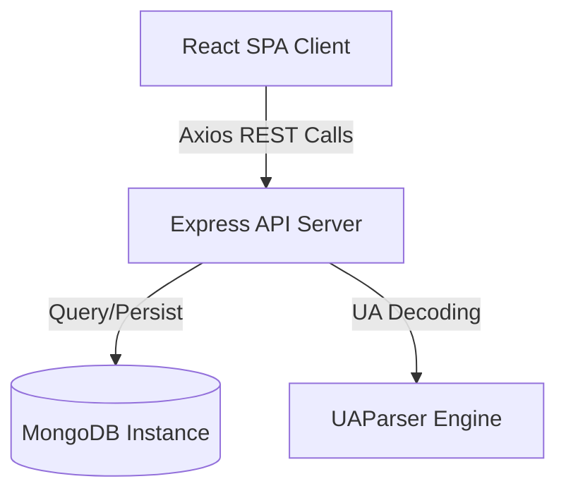
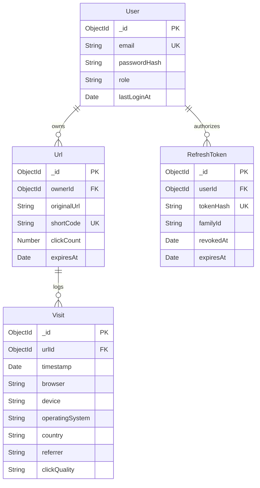
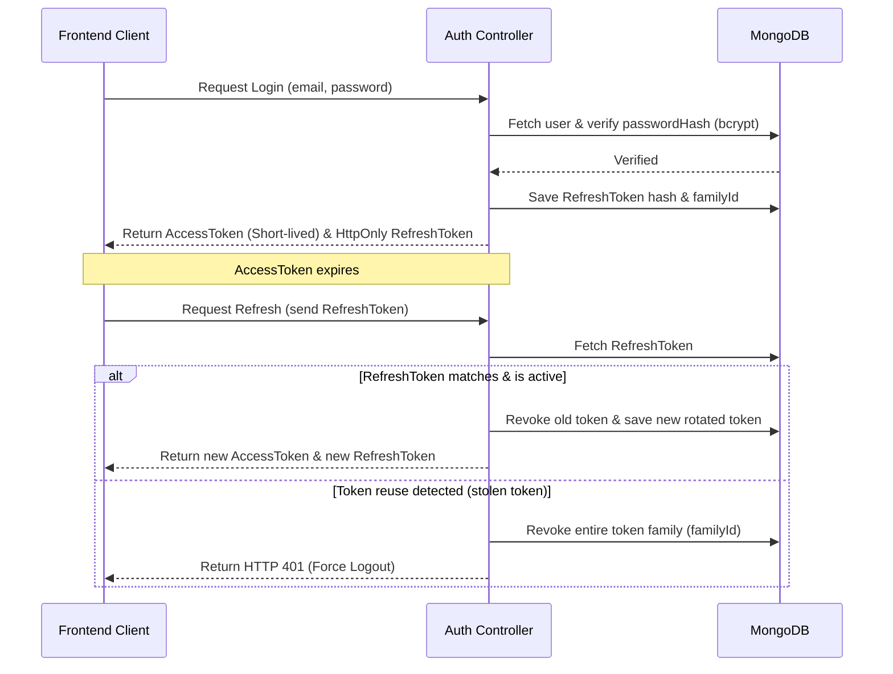
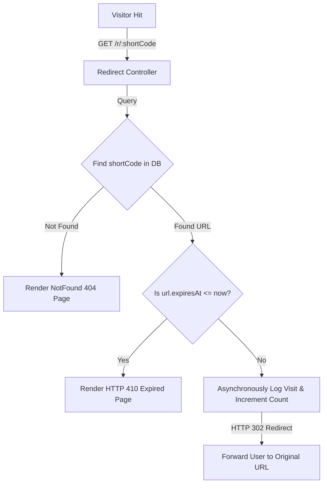

# 🤖 AI Planning & Architectural Design Document
**Project**: Lynko URL Shortener Platform  
**Target Audience**: Hackathon Judges, Technical Interview Panel, and Principal Architects  

---

## 1. Problem Statement
In modern web ecosystems, URLs serve as primary interaction vectors. However, raw URLs are often long, heavily parameterized with UTM tracking values, and structurally fragile. Standard URL shorteners compress links but fail to resolve deeper engineering and business concerns:
1.  **Telemetry Blackbox**: Existing tools provide generic hit counters, lacking information on visitor device dynamics, browser distributions, geographical distribution, and traffic quality.
2.  **Security Risks**: Shortened pathways are vulnerable to token replay attacks, link hijacking, and redirection spoofing.
3.  **Campaign Alignment**: Businesses need unified dashboards supporting custom vanity aliases, downloadable QR codes, and bulk CSV uploads to sync marketing campaigns.

**Lynko** solves these issues by acting as an enterprise-grade self-hosted redirection and visitor telemetry platform. It provides high-performance redirection handling coupled with secure session rotation and real-time visualization dashboards.

---

## 2. Requirement Analysis

### 📋 Product Feature Matrix

| Category | Requirement | Type | Description / Implementation Target |
| :--- | :--- | :---: | :--- |
| **Authentication** | User Signup & Login | Mandatory | Hashed credential verification (`bcrypt`) & stateless token delivery. |
| **Authentication** | Protected Route Gates | Mandatory | Client side route guards and layout shells. |
| **Link Management**| URL Shortening | Mandatory | Sanity-checked redirection mapping with database persistence. |
| **Link Management**| Unique Code Resolution | Mandatory | Collision-proof alphanumeric code generator. |
| **Link Management**| Custom Vanity Alias | Bonus | Unique user-defined custom redirects (e.g., `/r/winter-sale`). |
| **Link Management**| Expiration Policies | Bonus | Auto-expiring links utilizing MongoDB TTL self-cleaning indices. |
| **Analytics** | Hit Count & Redirections | Mandatory | Real-time click counters synced to background visit logging. |
| **Analytics** | Client-Agent Tracking | Bonus | Capture and parse browser, OS, and device type. |
| **Analytics** | Traffic Quality Audit | Bonus | Categorization of visitor hits (`human`, `bot`, `suspicious`). |
| **Analytics** | Geolocation Mapping | Bonus | Resolves client IP address down to country origin. |
| **Advanced Operations**| Bulk CSV Import | Bonus | PapaParse-assisted multi-link processing wizard. |
| **Advanced Operations**| Public Metrics Sharing| Bonus | Read-only statistics view for sharing link metrics with third parties. |

---

## 3. Feature Planning Matrix

| Feature Module | Priority | Complexity | Business Value | Target Stage |
| :--- | :---: | :---: | :---: | :---: |
| **JWT Session Infrastructure & Rotation** | P0 | High | Critical | Phase 2 |
| **Asynchronous Redirection Engine** | P0 | Low | Critical | Phase 4 |
| **Responsive UI Grid & Sidebar Shells** | P0 | Medium | High | Phase 9 |
| **Mongoose Collection Aggregations** | P1 | High | High | Phase 5 |
| **Zod Request Body Validators** | P1 | Low | High | Phase 4 |
| **TTL Collection Cleanup Routines** | P1 | Low | Medium | Phase 4 |
| **PapaParse Threaded CSV Reader** | P2 | Medium | High | Phase 7 |
| **UAParser Device Metadata Decoder** | P2 | Medium | High | Phase 5 |
| **Vector QR Code Encoder API** | P2 | Low | Medium | Phase 4 |

---

## 4. Architecture Decisions & Rationale



### 🛠️ Technology Architecture Stack

| Technology | Role | Selection Rationale |
| :--- | :--- | :--- |
| **React (Vite)** | Frontend Engine | Delivers lightweight client-side routing, instant hot-reloading (HMR), and component-level reusability. |
| **TailwindCSS** | Design System | Speeds up styling implementation while maintaining our custom retro-brutalist theme across all components. |
| **Express.js** | Backend API | Provides a lightweight, unopinionated routing layer that minimizes latency during request-to-redirect handshakes. |
| **MongoDB** | Database Store | Offers a schema-less structure that accommodates flexible, high-frequency telemetry logs (`Visit` documents) without blocking execution tables. |
| **JWT & Refresh Tokens** | Auth Architecture | Keeps APIs stateless. Implements Refresh Token Rotation (RTR) to detect and block token replay attacks on public clients. |
| **Recharts** | Analytics Visuals | Render SVG charts directly in React components. |
| **PapaParse** | CSV Processor | Handles heavy file processing client-side to prevent main-thread freezing. |

---

## 5. Database Design Planning

### 📊 Entity-Relationship Diagram (ERD)



### ⚡ Collection Indexes and Optimization Strategies

-   **`User`**: Indexed on `{ email: 1 }` (unique) to speed up authentication lookups.
-   **`Url`**:
    -   `{ shortCode: 1 }` (unique) ensures $O(1)$ query speeds during redirection lookups.
    -   `{ ownerId: 1, clickCount: -1 }` optimizes user dashboard listings.
    -   `{ expiresAt: 1 }` with `{ expireAfterSeconds: 0 }` automatically purges expired links in the background.
-   **`Visit`**: Indexed on `{ urlId: 1, timestamp: -1 }` to optimize paginated logs and trend graph generations.

---

## 6. Authentication Planning

To secure credentials and prevent session hijacking, we designed a stateless authentication loop featuring **Refresh Token Rotation (RTR)**:



---

## 7. URL Redirection & Expiration Flow



-   **Collision Prevention**: Standard shortcodes are generated using a cryptographically random string generator. If a duplicate key occurs, the generator loops until a unique code is resolved.
-   **Expirations**: During the lookup path, if `expiresAt` is present, it is compared against `new Date()`. Expired links immediately throw an HTTP `410 Gone` error.

---

## 8. Analytics & Telemetry Processing

Visit telemetry is parsed from incoming HTTP request metadata and stored as a structured `Visit` record:

| Source Attribute | Parsing Method | Extracted Variable | DB Field |
| :--- | :--- | :--- | :--- |
| **`User-Agent` Header** | Regex engine matching | Chrome, Firefox, Safari, Edge, etc. | `browser` |
| **`User-Agent` Header** | Signature scanning | Mobile, Desktop, Tablet | `device` |
| **`User-Agent` Header** | Signature matching | Windows, macOS, Linux, iOS, Android | `operatingSystem`|
| **`Referer` Header** | Hostname extraction | Google, Twitter, LinkedIn, Direct, etc. | `referrer` |
| **`CF-Connecting-IP`** | Geolocation lookup | India, United States, Canada, etc. | `country` |
| **Bot signature lists** | Header check | Human, Automated Bot, Suspicious | `clickQuality` |

---

## 9. Frontend View Architecture

The frontend is divided into modular, high-impact layout sectors:

```
┌────────────────────────────────────────────────────────┐
│                      App.jsx                           │
│  ┌───────────────────────┬──────────────────────────┐  │
│  │     Public Routes     │     Protected Routes     │  │
│  │   (Login, Signup,     │    (DashboardLayout)     │  │
│  │    Home, Stats)       │   (Urls, Analytics, me)  │  │
│  └───────────────────────┴──────────────────────────┘  │
└────────────────────────────────────────────────────────┘
```

-   **DashboardLayout**: Houses the navigation panel, user indicators, and responsive content area.
-   **Quick Shorten Form**: Standardized inputs containing instant inline feedback, featuring a responsive grid layout:
    -   `Mobile (<640px)`: Stacks fields vertically.
    -   `Tablet (640px to 1024px)`: Expands URL target to full width, placing alias and expiry inputs side-by-side.
    -   `Desktop (1024px+)`: Displays all three fields in a single line.

---

## 10. AI-Assisted Development Workflow

The project was developed using a structured, AI-assisted workflow:


1.  **Planning & Specifications**: Formulated database schemas, endpoint maps, and Brutalist design tokens.
2.  **Scaffolding & Boilerplates**: Auto-generated Express middleware configurations and React context shells.
3.  **AI Code Auditing & Linting**: Inspected generated scripts to fix HMR compatibility errors, unmatched JSX closing tags in `App.jsx`, and duplicate exports in layout components.
4.  **Refactoring & Polishing**: Tweak UI layouts, optimize responsiveness, and fix HMR tag structures.
5.  **Validation**: Tested redirect sequences, token refreshes, and verified database indexes.

---

## 11. Implementation Timeline & Phases

| Phase | Title | Main Deliverables |
| :--- | :--- | :--- |
| **Phase 1** | Architecture | Project setup, folder structures, Tailwind CSS variables. |
| **Phase 2** | Authentication | Password hashing, JWT token generation, Refresh Token Rotation. |
| **Phase 3** | Protected Routing | Client-side routing guards, layout wrappers, Axios interceptors. |
| **Phase 4** | URL CRUD | Code generator, custom aliases, expirations, edit/delete routes. |
| **Phase 5** | Analytics | Visit logging, browser/OS/device parsers, daily trends charts. |
| **Phase 6** | Public Stats | Read-only public stats views and charts by shortcode. |
| **Phase 7** | Bulk Upload | PapaParse integration, batch URL validation, CSV processing. |
| **Phase 8** | Traffic Quality | Bot detection middleware, human/bot classification schemas. |
| **Phase 9** | UI/UX Polishing | Brutalist card offsets, loading states, full-screen loaders. |
| **Phase 10**| Verification | Validation reviews, token rotation tests, indexing verification. |
| **Phase 11**| Deployment | Client hosting on Vercel, server deployment on Render. |

---

## 12. Challenges Faced & Mitigations

### 1. Client-Side Session Continuity & RTR Replay Vulnerability
*Challenge*: Storing access tokens in browser memory is secure but lost on refresh. Storing refresh tokens in cookies or storage exposes them to theft.  
*Mitigation*: Implemented Refresh Token Rotation (RTR). The backend tracks token family chains in the database. If a token is reused (indicating a stolen token is being replayed), the server revokes the entire token family, forcing a logout on all client sessions.

### 2. High-Frequency Redirection Performance
*Challenge*: Resolving database writes during redirects can cause delay before redirecting.  
*Mitigation*: Database writes for visit tracking (`Visit.create()`) and click metrics increments are executed asynchronously, allowing the API to return the HTTP `302` redirect headers immediately.

---

## 13. Project Assumptions
- **Storage Strategy**: Relies on a MongoDB instance with high connection availability.
- **Shortcode Character Limits**: Vanity shortcode paths are validated to `4-32` characters containing only alphanumeric characters, dashes, and underscores.
- **Visitor IPs**: Behind proxies (like Cloudflare or Render), visitor country parsing assumes standard HTTP header routing keys (e.g. `CF-Connecting-IP` or `X-Forwarded-For`) are present.

---

## 14. Future Roadmap
1.  **Distributed Caching**: Integrate Redis caching to resolve target URLs faster.
2.  **Shared Workspaces**: Allow team members to manage links jointly.
3.  **Custom Domains**: Allow users to point their own domains to the shortener.
4.  **Interactive Geolocation Maps**: Interactive world maps highlighting click locations.

---

## 15. Conclusion
**Lynko** represents a highly secure, performant URL management and telemetry architecture. Splitting layers cleanly (Routes ➡️ Controllers ➡️ Services ➡️ Models) keeps code modular and maintainable, while the custom brutalist UI provides a unique, memorable, and responsive user experience. The system is scalable, secure, and ready for production deployment.
