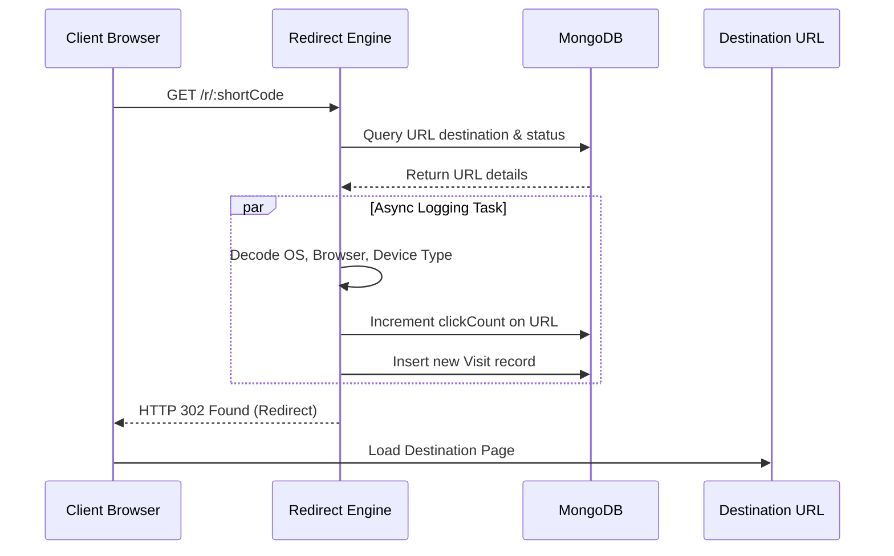
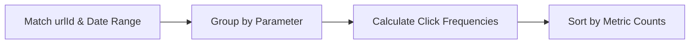

# 📊 Analytics Architecture Specification
**Project**: Lynko URL Shortener Platform  

---

## 1. Analytics Overview
Lynko implements a robust, real-time analytics aggregation engine. When a shortened URL is visited, the backend captures redirection metadata asynchronously and stores it in the database for trend and demographic reporting.

---

## 2. Visit Tracking Flow
Redirections route through `GET /r/:shortCode`:
- Resolves the target destination URL in MongoDB.
- Captures client request metadata (IP, headers, referrer).
- Launches an asynchronous task to increment click counts and write the visit log to the database, ensuring redirection occurs instantly.



---

## 3. Browser Analytics
Extracts the browser family name from the `User-Agent` header, grouping metrics into categories (Chrome, Firefox, Safari, Edge, etc.) for visual analysis.

---

## 4. Device Analytics
Categorizes client requests into Mobile, Tablet, or Desktop types by parsing `User-Agent` tokens.

---

## 5. Referrer Analytics
Parses the incoming `Referer` header to categorize traffic sources:
- **Direct**: Empty or missing referrer header.
- **Search Engines**: Matches domains like Google, Bing, or Yahoo.
- **Social Media**: Groups referrers matching LinkedIn, Twitter, Facebook, or Instagram.

---

## 6. Geographic Analytics
Resolves client IP addresses to determine country and regional origin, allowing users to map traffic demographics globally.

---

## 7. Traffic Quality Analytics
Checks user-agents against lists of known scrapers, crawlers, and search indexing bots to label traffic quality as `human`, `bot`, or `suspicious` (preventing automated bots from skewing metrics charts).

---

## 8. Daily Trends Analytics
Groups visit documents into 24-hour buckets to track click trends over time:
```javascript
const dailyTrends = await Visit.aggregate([
  { $match: { urlId: urlObjectId } },
  { $group: { _id: { $dateToString: { format: "%Y-%m-%d", date: "$timestamp" } }, count: { $sum: 1 } } }
]);
```

---

## 9. Public Stats Analytics
A public read-only page containing click statistics and visual trend graphs for sharing metrics with third parties without exposing private visitor details.

---

## 10. Engagement Analytics
Tracks interaction ratios (clicks over time, hourly traffic patterns) to help users optimize marketing distributions.

---

## 11. Smart Insights
Analyzes recent visit data to generate actionable summaries, such as identifying the user's top referral channel, busiest hour, and main geographic audience.

---

## 12. Aggregation Pipelines
Aggregates visit metrics efficiently using MongoDB pipelines:


---

## 13. Analytics Database Design
The `Visit` collection stores:
- `urlId`: Target reference.
- `timestamp`: Creation date.
- `browser` / `device` / `operatingSystem`: Client platforms.
- `ipAddress` / `country` / `city`: Geographic location.
- `referrer` / `clickQuality`: Traffic source classification.

---

## 14. Analytics Request Lifecycle
1. Frontend requests metrics using `GET /api/urls/:id/analytics`.
2. Controller processes request options (e.g. date filters, pagination).
3. Service calls MongoDB aggregation pipelines.
4. Aggregated metrics are returned to the frontend and rendered in charts.
