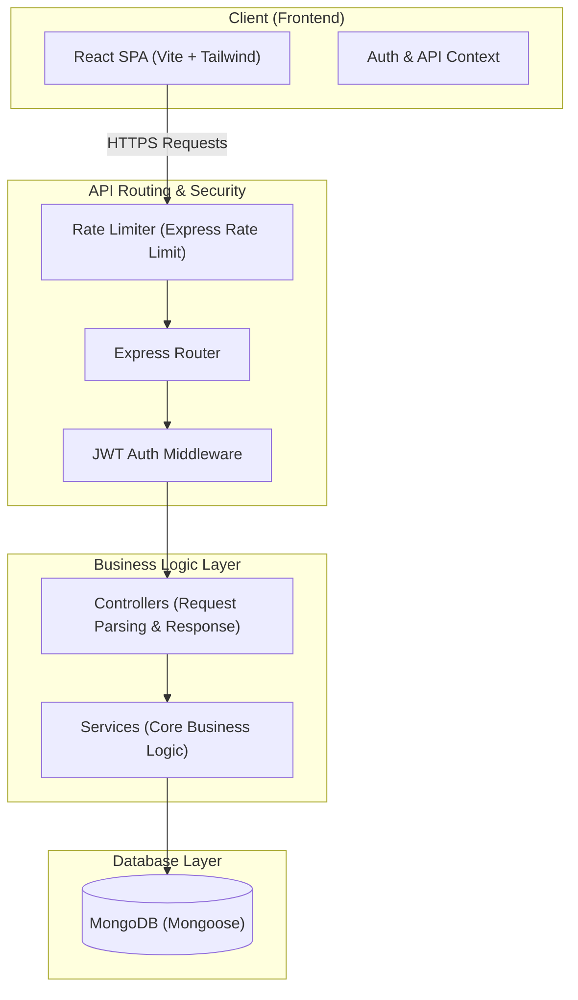
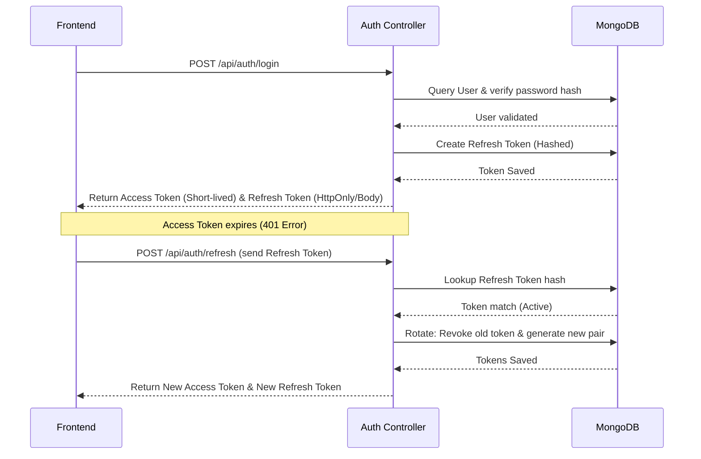
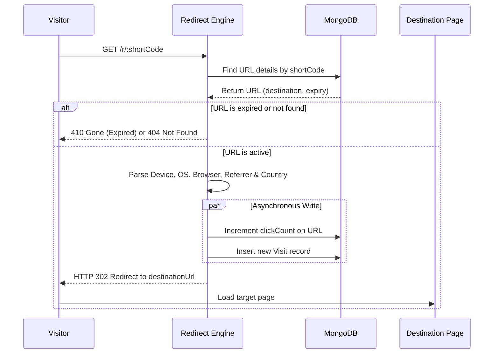

# Lynko URL Shortener Platform — Architecture Document

This document outlines the technical design, architectural patterns, database schemas, and data flows implemented in the **Lynko** full-stack URL shortening and analytics platform.

---

## 🏛️ High-Level Architecture Diagram

---

## 💻 Frontend Architecture

The frontend is a modern React SPA optimized for speed, responsive design, and brutalist aesthetics.

### 1. Component Hierarchy & Layouts
- **`App.jsx`**: Main router switch configuring general (navbar-enabled), public-only (gated auth forms), and protected paths.
- **`DashboardLayout.jsx`**: Left-side layout wrapper housing navigation sidebars, user details, and page views.
- **`Navbar` / `MobileSidebar`**: Adaptive navigation drawer layout matching target viewports.
- **UI Primitives**: Custom Brutalist-styled reusable components:
  - `Card`: Renders containers with offset outlines and `dogEar` design accents.
  - `Button`: Standardized actions with brutalist offset active translate shifts.
  - `Input`: Integrated label, error state, and hint descriptors.

### 2. State Management & API Hookup
- **`AuthContext.jsx`**: Centralized authentication store managing token storage, Axios automatic interceptors (triggering token refresh on `401 Unauthorized`), and login/registration flows.
- **`useUrls` / `useAnalytics` Hooks**: Abstracted service interfaces for modular API consumption.
- **Recharts Integration**: Fluid charts visualizing click trends, browser/device ratios, and geographic demographics.

---

## ⚙️ Backend Architecture

The backend is built as a layered Express.js REST API enforcing clean separation of concerns.

### 1. Modular Directory Layout
- **`routes/`**: Handles endpoint definition, rate-limiting, and middleware injection.
- **`controllers/`**: Parses HTTP request headers, query parameters, validation errors, and handles response serialization.
- **`services/`**: Houses core transactional operations, database interactions, safety integrations, and calculations.
- **`model/`**: Houses database schemas and indexing parameters.
- **`validators/`**: Defines Zod validation schemas to sanitize inputs before controllers process data.

### 2. Redirection & Analytics Resolution
- Redirections route through `GET /r/:shortCode`.
- Performs instant base-level checks (exists/expired).
- Tracks user agent metrics (browser, OS, device) using parser checks, parses referrers, evaluates UTM campaigns, and asynchronously persists records to the database.

---

## 🗄️ Database Design

MongoDB is used as the core database store with Mongoose schemas.

### 1. Model Schemas

#### User Schema (`User`)
- `email`: String (Unique, Lowercase, Indexed)
- `name`: String
- `phone`: String
- `passwordHash`: String (Selected false by default)
- `role`: String (Enum: `["user", "admin"]`)
- `lastLoginAt`: Date

#### Url Schema (`Url`)
- `ownerId`: ObjectId (Ref User, Indexed)
- `originalUrl`: String
- `shortCode`: String (Unique, Indexed)
- `clickCount`: Number (Indexed for sorting)
- `expiresAt`: Date (TTL Index)
- `platforms`: Array (Enum)

#### Visit Schema (`Visit`)
- `urlId`: ObjectId (Ref Url, Indexed)
- `timestamp`: Date (Indexed)
- `browser`: String
- `device`: String
- `operatingSystem`: String
- `ipAddress`: String
- `country`: String (Indexed)
- `referrer`: String (Indexed)
- `clickQuality`: String (Enum: `["human", "bot", "suspicious"]`)

---

## 🔄 Sequence Flows

### 🔑 Authentication & Token Rotation Flow

### 🔀 Redirection & Analytics Processing Flow

