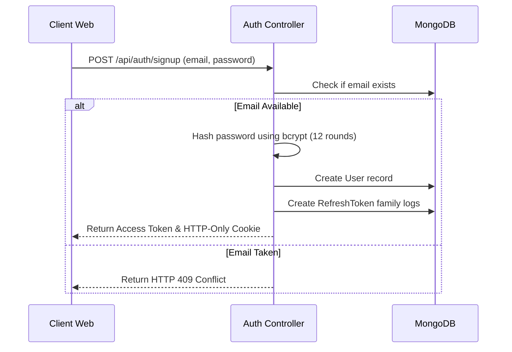
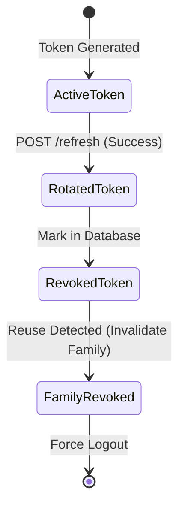

# 🔐 Authentication Architecture Specification
**Project**: Lynko URL Shortener Platform  

---

## 1. Authentication Overview
Lynko implements a stateless, token-based authentication framework utilizing JSON Web Tokens (JWT) for API authorization and rotated refresh tokens to manage persistent sessions safely.

---

## 2. Registration Flow
- Enforces unique email requirements.
- Hashes passwords using bcrypt (12 rounds) on the backend.
- Generates access/refresh token pairs and stores session logs in the database.



---

## 3. Login Flow
Validates the user's password hash against the stored database record, updates `lastLoginAt`, and generates new token pairs.

---

## 4. JWT Architecture
- **Access Tokens**: Short-lived (15 minutes), containing the user's ID, role, and signing signatures. Stored in memory on the client side.
- **Refresh Tokens**: Long-lived (7 days), stored securely in HTTP-Only cookies to protect them from XSS attacks. Checked against database records upon rotation request.

---

## 5. Access Token Lifecycle
Used to authorize API requests. Passed in authorization headers as `Bearer <token>`. Automatically invalidated when expired, triggering a transparent session rotation request from the frontend.

---

## 6. Refresh Token Lifecycle
Stored as a cryptographically signed hash in the database, tracking its creation timestamp, expiry date, IP address, and associated token family (`familyId`).

---

## 7. Refresh Token Rotation (RTR)
RTR guards against token theft by ensuring refresh tokens are rotated and single-use:
- When the frontend requests a session refresh, the backend revokes the current refresh token and issues a new pair.
- If a revoked refresh token is sent (indicating a session replay attack), the backend revokes the entire token family, forcing a global logout on all client sessions.



---

## 8. Session Restoration
When the frontend loads, it attempts to fetch the user's profile using the active access token. If expired or missing, it calls `/api/auth/refresh` to restore the session using the HTTP-Only cookie.

---

## 9. Protected Route Flow
The client-side router checks `isAuthenticated` and token validity before mounting components. If unauthorized, it redirects users directly to `/login`.

---

## 10. Logout Flow
Clears authorization states on the client and calls `POST /api/auth/logout` to revoke refresh tokens and delete cookies from the browser.

---

## 11. Ownership Authorization
Ensures database operations are scoped to the authenticated user's ID:
```javascript
const userLinks = await Url.find({ ownerId: req.user.id });
```
This scopes requests directly to the user's data, preventing unauthorized access across user spaces.

---

## 12. Security Considerations
- **HTTP-Only Cookies**: Prevents client-side scripts from reading tokens, mitigating XSS attacks.
- **Bcrypt (12 Rounds)**: Protects passwords against brute-force attacks.
- **JWT Signing**: Access tokens are signed using high-entropy keys configured in environment variables.
