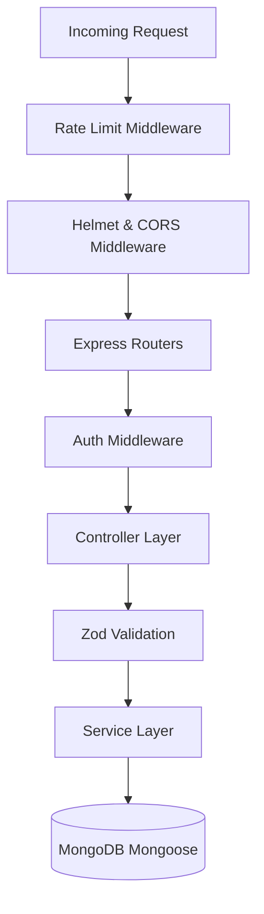
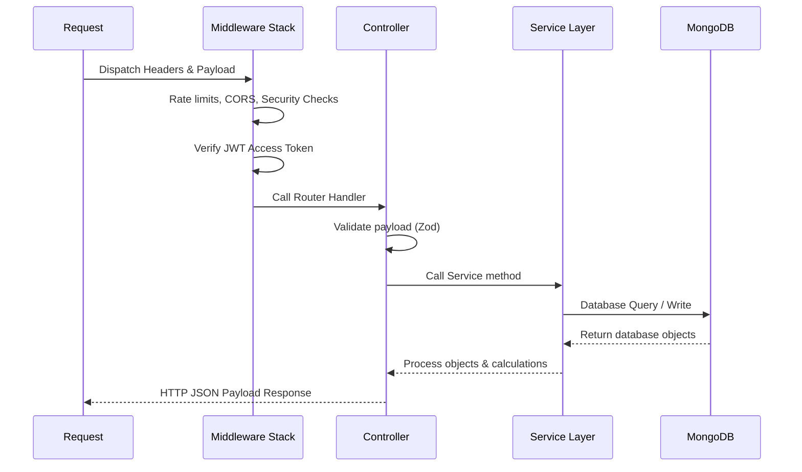

# ⚙️ Backend Architecture Specification
**Project**: Lynko URL Shortener Platform  

---

## 1. Backend Overview
The Lynko API backend is constructed using Node.js and Express. It manages rate limiting, authentication, payload validation, database operations, and redirects, all optimized for high-volume redirection throughput.

---

## 2. Express Architecture
The Express instance operates as a layered routing architecture, separating HTTP mapping, controller parsing, service operations, and database persistence.



---

## 3. Route Layer
Decoupled into modular route controllers mapping core business areas:
- `authRoutes`: User sessions, registration, credentials validation, password resets.
- `urlRoutes`: Link creation, deletion, modifications, bulk updates.
- `redirectRoutes`: Resolves shortcodes to handle redirects.
- `analyticsRoutes` / `analyticsEngagementRoutes`: Dynamic aggregation and telemetry details.

---

## 4. Controller Layer
Controllers parse HTTP parameters (route IDs, query filters, headers) and validate request payloads against Zod validation schemas. They return consistent JSON responses, leaving data aggregation and database writes to the Service Layer.

---

## 5. Service Layer
The core transactional layer. Services manage calculations, generate shortcode targets, parse visitor user-agents, calculate daily trends, and coordinate database writes.

---

## 6. Model Layer
Manages MongoDB database schemas via Mongoose:
- **`User`**: Hashes passwords securely and tracks status flags.
- **`Url`**: Manages short link configurations and expirations.
- **`Visit`**: Stores granular logs for visitor analytics.
- **`RefreshToken`**: Handles session rotations.

---

## 7. Validation Layer
Strict input validation is enforced using Zod schemas:
- Validates that `originalUrl` matches standard URL formats.
- Ensures custom aliases match safe alphanumeric patterns (`/^[a-zA-Z0-9_-]{4,32}$/`).
- Sanitions request parameters like database ObjectIds before queries are executed.

---

## 8. Middleware Layer
- **`authMiddleware`**: Verifies JWT signatures and populates request objects with user profiles.
- **`rateLimiter`**: Prevents brute-force attacks on auth endpoints and rate-limits redirects.
- **`errorMiddleware`**: Catch-all handler that standardizes error shapes for client responses.

---

## 9. Error Handling Layer
The custom `AppError` class standardizes error payloads, returning:
```json
{
  "message": "Error description details",
  "details": "Optional validation arrays (e.g. Zod field errors)"
}
```

---

## 10. Request Lifecycle


---

## 11. URL Creation Flow
When creating a link, the backend validator validates the payload, checks for custom alias availability (or generates a random shortcode), and writes the document to MongoDB.

---

## 12. Redirect Flow
Redirection is optimized for speed:
- Looks up the shortcode in MongoDB.
- Validates that the link is active and not expired.
- Asynchronously logs the visit and increments the click counter.
- Immediately sends an HTTP `302 Found` response with the target destination URL in the headers.

---

## 13. Analytics Flow
Visits are decoded using user-agent parsers to extract browser, OS, and device type information. These details are stored as a structured `Visit` document alongside IP address, country, and referrer, allowing for deep telemetry analysis.

---

## 14. Bulk Upload Flow
Parses input CSV rows, validates each record against Zod schemas, checks alias availability, and performs bulk database writes inside a single transaction to maintain efficiency.

---

## 15. Security Layer
- **Helmet**: Disables headers that reveal system specifications and enables protection against clickjacking.
- **Strict CORS**: Sets strict origin policies targeting verified domain settings.
- **Database Safety**: Restricts search queries to the owner's user ID to prevent cross-account modifications.

---

## 16. Backend Folder Structure
```
backend/
├── config/             # Database and environment configurations
├── controllers/        # Express route handlers
├── middleware/         # Auth, validation, and security middleware
├── model/              # MongoDB Mongoose schemas
├── routes/             # Express API routes
├── services/           # Core database transactions and business logic
├── utils/              # Token helpers, time parsers, loggers
└── validators/         # Input validation schemas via Zod
```

---

## 17. Backend Scalability Design
- **Query Indexing**: Adding indices to high-frequency query fields like `shortCode` and `ownerId` ensures lookup operations remain fast as database size grows.
- **Asynchronous Logging**: Logging visits and updating click counts asynchronously ensures that database writes do not block or delay redirection response times.
