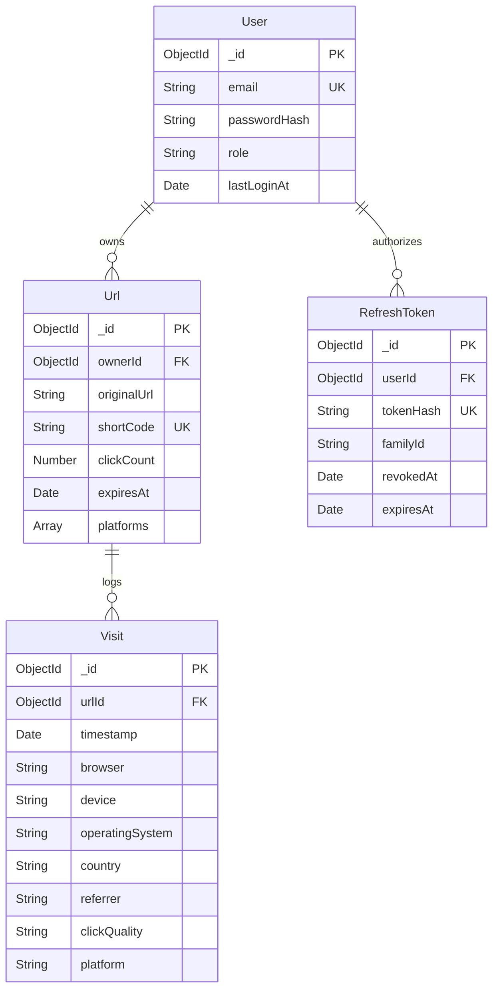
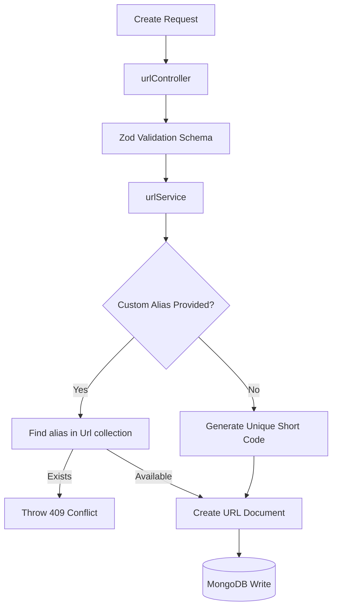
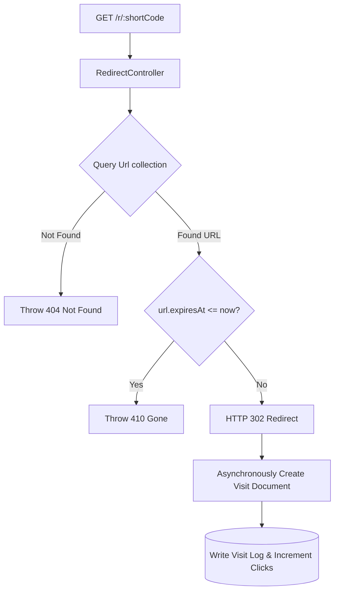

# 🗄️ Database Architecture Specification
**Project**: Lynko URL Shortener Platform  

---

## 1. Database Overview
Lynko uses **MongoDB** as its primary data store, managed via the **Mongoose ODM** (Object Document Mapper). MongoDB was selected for the following reasons:
- **Flexible Document Model**: Allows visitor telemetry (`Visit` documents) containing varying fields (different headers, referrers, and geolocation parameters) to be stored cleanly without rigid table schemas.
- **Fast Writes**: Redirection requires fast analytics logging. MongoDB's document structure enables rapid, non-blocking inserts.
- **Dynamic Aggregations**: Supports powerful native aggregation pipelines to group, filter, and sort time-series click logs dynamically.

---

## 2. Database ER Diagram



---

## 3. User Collection
- **Purpose**: Stores authenticated user accounts and credentials.
- **Fields**:
  - `_id` (ObjectId, Primary Key)
  - `email` (String, Lowercase, Trimmed, Unique)
  - `passwordHash` (String, Hidden by default in queries)
  - `role` (String, Enum: `["user", "admin"]`, Default: `"user"`)
  - `isActive` (Boolean, Default: `true`)
  - `lastLoginAt` (Date)
- **Indexes**: `{ email: 1 }` (Unique index to prevent duplicate signups and speed up authentication).

---

## 4. Url Collection
- **Purpose**: Maps generated shortcodes to target destination URLs.
- **Fields**:
  - `_id` (ObjectId, Primary Key)
  - `ownerId` (ObjectId referencing `User`, Indexed)
  - `originalUrl` (String, Sanitized URL format)
  - `shortCode` (String, Unique, Indexed)
  - `clickCount` (Number, Default: `0`)
  - `expiresAt` (Date, Optional, TTL indexed)
  - `platforms` (Array of Strings, Enum tracking target sharing platforms)
- **Core Operations**:
  - **Short Code**: Randomly generated unique 6-character identifier.
  - **Custom Alias**: User-supplied custom path, validated against character rules and checked for uniqueness.
  - **Expiration**: Optional timestamp. If present, the redirection service blocks access when the current time passes the limit.
  - **QR Code**: Exposes API links to generate QR codes on demand.
  - **Click Count**: Incremented atomically during redirect requests.
  - **Ownership**: Queries check the caller's ID against `ownerId` before modifications.
- **Indexes**:
  - `{ shortCode: 1 }` (Unique index for redirections).
  - `{ ownerId: 1, clickCount: -1 }` (Speeds up dashboard listings).
  - `{ expiresAt: 1 }` (TTL index configured with `expireAfterSeconds: 0` to automatically delete expired links).

---

## 5. Visit Collection
- **Purpose**: Logs telemetry for visitor redirection events.
- **Fields**:
  - `_id` (ObjectId, Primary Key)
  - `urlId` (ObjectId referencing `Url`, Indexed)
  - `timestamp` (Date, Indexed)
  - `browser` (String, parsed from User-Agent)
  - `device` (String, Mobile/Tablet/Desktop)
  - `operatingSystem` (String, OS details)
  - `ipAddress` (String)
  - `country` (String, Geolocation parse)
  - `referrer` (String, Source domain)
  - `clickQuality` (String, Human/Bot/Suspicious categorization)
  - `platform` (String, Optional target social share platform)
- **Indexes**:
  - `{ urlId: 1, timestamp: -1 }` (Speeds up loading logs and trends charts).
  - `{ urlId: 1, country: 1 }` (Optimizes geographic analytics aggregations).
  - `{ urlId: 1, browser: 1 }` (Optimizes client engine reporting).

---

## 6. RefreshToken Collection
- **Purpose**: Tracks active session tokens to support refresh token rotation.
- **Fields**:
  - `_id` (ObjectId, Primary Key)
  - `userId` (ObjectId referencing `User`)
  - `tokenHash` (String, Cryptographic hash of token)
  - `familyId` (String, Tracks session chains)
  - `revokedAt` (Date, Populated when rotated)
  - `expiresAt` (Date, TTL auto-expiry)
- **Rotation and Revocation**:
  - Replaces token hashes on every `/refresh` action.
  - If a client attempts to reuse a revoked token, the backend revokes the entire `familyId` group, logging out the user across all devices.
- **Indexes**:
  - `{ tokenHash: 1 }` (Speeds up session validity checks).
  - `{ expiresAt: 1 }` (TTL index deletes expired session hashes automatically).

---

## 7. Query Flows

### URL Creation Flow


### Redirection & Analytics Flow


---

## 8. Indexing Strategy
The indexing strategy uses specific indexes to optimize performance:
1.  **Unique Indexes**: `{ email: 1 }` and `{ shortCode: 1 }` ensure uniqueness constraints are enforced in the database.
2.  **Compound Indexes**: `{ ownerId: 1, clickCount: -1 }` avoids memory-sorting operations when fetching dashboard rankings.
3.  **TTL Indexes**: `{ expiresAt: 1 }` automatically cleans up expired database records, preventing collection bloat.

---

## 9. Analytics Aggregation Design
Aggregations are handled using MongoDB's `$facet` and `$group` pipelines:
- **Click Tracking**: Updates click counts atomically using `$inc: { clickCount: 1 }`.
- **Browser/Device/Referrer/OS Breakdown**: Groups and counts documents using the `$group` stage:
  ```javascript
  { $group: { _id: "$browser", count: { $sum: 1 } } }
  ```
- **Geographic & Quality Audits**: Filters and tallies records based on parsed parameters (`country`, `clickQuality`).
- **Daily Trend curves**: Formats date strings (`%Y-%m-%d`) and groups visit counts by date.

---

## 10. Database Security
- **Strict Validations**: Uses Zod validation schemas to sanitize inputs before database queries.
- **Ownership Scoping**: Database queries for edit and delete actions are scoped to the user ID:
  ```javascript
  const target = await Url.findOne({ _id: linkId, ownerId: req.user.id });
  ```
- **Password Encryption**: Uses Bcrypt hashing to encrypt credentials before database storage.
- **Token Isolation**: Sessions are isolated using unique `familyId` token groups, limiting impact in the event of a compromised token.

---

## 11. Conclusion
Lynko's database architecture utilizes MongoDB's flexible document structure and targeted indexing to deliver high-performance write speeds and fast query execution, ensuring the system remains responsive as it scales.
