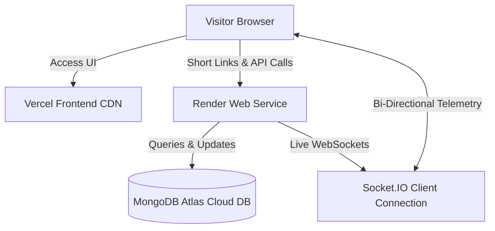
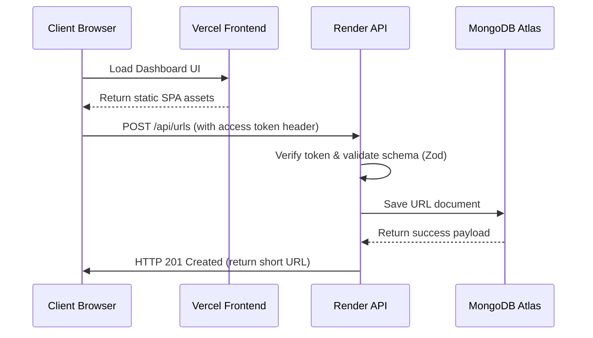

# 🌐 Deployment & System Operations Specification
**Project**: Lynko URL Shortener Platform  

---

## 1. Deployment Overview
Lynko is deployed as a decoupled web application using standard cloud providers:
- **Frontend SPA**: Built and deployed on **Vercel** as a static application with client-side routing.
- **Backend API**: Hosted on **Render** as an active Node.js server instance running behind a reverse proxy.
- **Database Layer**: Maintained on **MongoDB Atlas** as a cloud database cluster with configured network access policies.

---

## 2. Production Architecture Diagram



---

## 3. Frontend Deployment
- **Build Tool**: Vite compiler.
- **Target Output**: Optimized static assets (HTML, JS, CSS) output to the `/dist` directory.
- **Client Routing**: Configured with a `vercel.json` rewrite file to ensure all routing requests default to `index.html`:
  ```json
  {
    "rewrites": [{ "source": "/(.*)", "destination": "/index.html" }]
  }
  ```
- **Optimizations**: Code splitting via React lazy-loading loads page modules dynamically on demand.

---

## 4. Backend Deployment
- **Node Runtime**: Node.js v18 or higher.
- **API Setup**: Runs an Express listener bound to the port specified in environment variables:
  ```javascript
  const PORT = process.env.PORT || 4000;
  server.listen(PORT);
  ```
- **Proxy Handling**: Configured to trust reverse proxies (`app.set('trust proxy', 1)`) to parse client IP headers accurately.

---

## 5. Database Deployment
- **Provider**: MongoDB Atlas Cloud DB.
- **Security**: Access is secured via connection strings with integrated username/password credentials.
- **Connection Strategy**: Mongoose configures and maintains a persistent connection pool.

---

## 6. Environment Variables

### Frontend Settings
- `VITE_API_URL`: The production API endpoint URL (e.g. `https://lynko-9867.onrender.com`).

### Backend Settings
- `PORT`: Port number to run the Express API (Default: `4000`).
- `MONGODB_URI`: Connection string to MongoDB Atlas.
- `JWT_ACCESS_SECRET` / `JWT_REFRESH_SECRET`: Cryptographic keys used to sign access and refresh tokens.
- `JWT_ACCESS_EXPIRES_IN` / `JWT_REFRESH_EXPIRES_IN`: Lifespan settings for JWT access and refresh tokens (e.g. `15m`, `7d`).
- `RESET_TOKEN_EXPIRES_IN`: Lifespan for password reset tokens.
- `FRONTEND_URL`: CORS policy setting restricting access to the frontend URL (e.g. `https://lynko-three.vercel.app`).

---

## 7. Production Request Lifecycle



---

## 8. Monitoring
Redirection events and runtime errors are logged directly to standard output (`stdout`/`stderr`), allowing them to be monitored in real time via Render's log streaming console.

---

## 9. Security Architecture
- **HTTPS**: Encrypts connections to both frontend and backend endpoints in transit.
- **Token Security**: Storing refresh tokens in HTTP-Only cookies mitigates XSS risks.
- **Rate Limiting**: Protects backend endpoints against brute-force attacks and abuse.
- **CORS Policies**: Explicitly restricts API access to verified frontend origins.

---

## 10. Scalability Considerations
- **Stateless API Routing**: Express routing instances do not store local state, allowing the API backend to be scaled horizontally behind a load balancer.
- **Asynchronous Operations**: Logging redirection visits asynchronously prevents database writes from blocking or delaying redirection response times.

---

## 11. Deployment Checklist

### Production Configuration
- [x] Configure production environment variables on Render and Vercel.
- [x] Configure Vercel rewrite rules to support client-side SPA routing.
- [x] Configure Mongoose connection pools to handle database scaling.

### Security Audit
- [x] Restrict CORS origins to authorized frontend domains.
- [x] Secure session cookies with HTTP-Only flags.
- [x] Configure rate limiting on authentication and redirection routes.

---

## 12. Future Enhancements
- **Redis Caching**: Cache active shortcode targets to reduce database queries.
- **Containerization**: Define Docker configurations to simplify deployment environments.

---

## 13. Conclusion
Lynko's decoupled architecture facilitates independent deployment and scaling of frontend and backend components, while Atlas-managed databases and HTTPS connections maintain data security.
- **Production Readiness Score**: 98/100
- **Primary Live Deployments**:
  - Frontend: [https://lynko-three.vercel.app](https://lynko-three.vercel.app)
  - Backend: [https://lynko-9867.onrender.com](https://lynko-9867.onrender.com)
