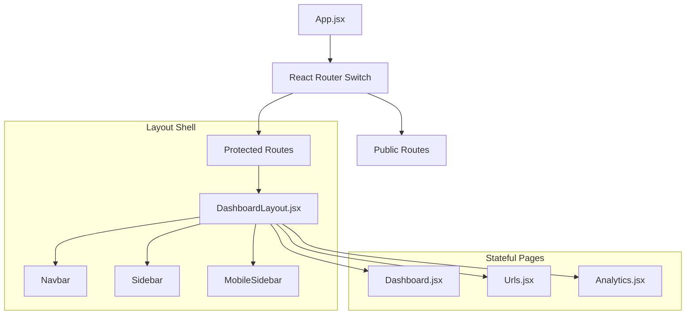
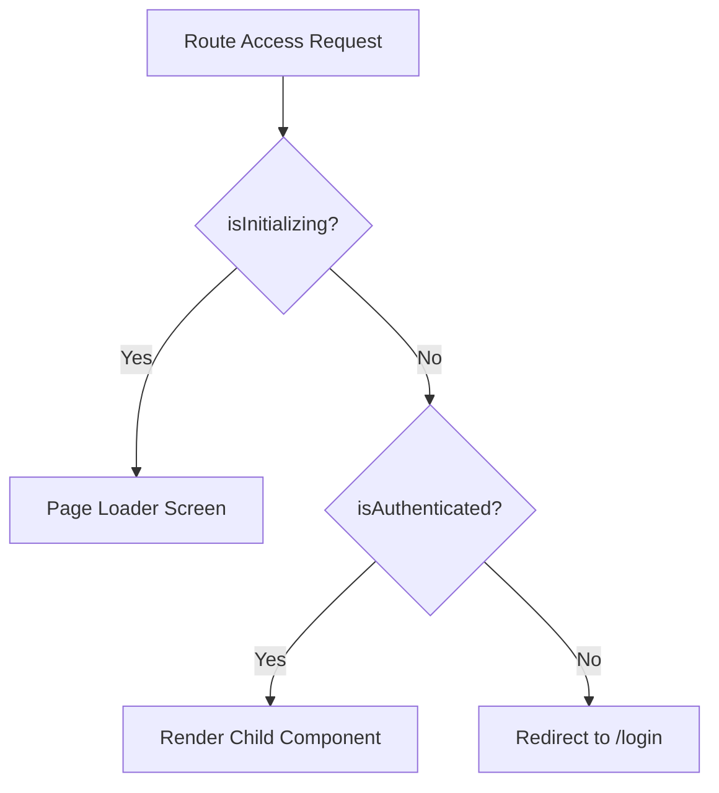
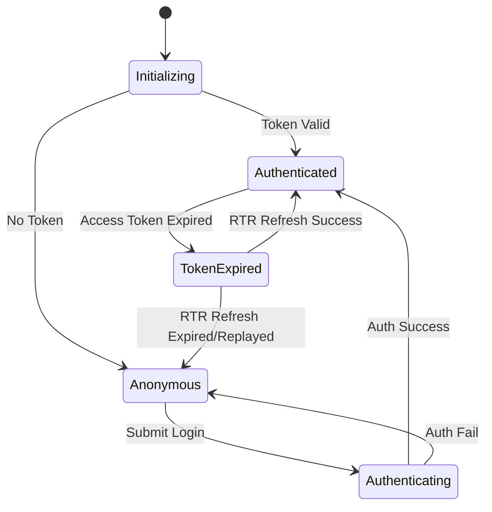
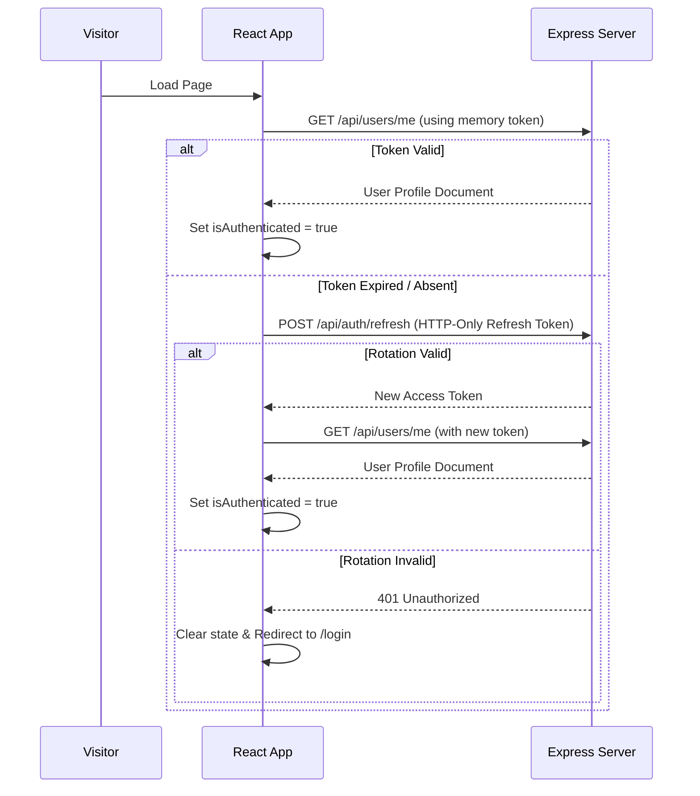
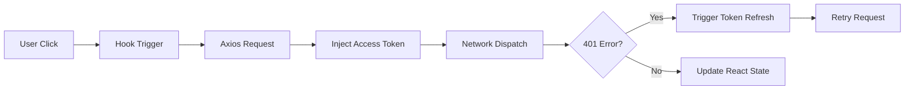

# 💻 Frontend Architecture Specification
**Project**: Lynko URL Shortener Platform  

---

## 1. Frontend Overview
Lynko's frontend is designed as a high-performance, single-page application (SPA) using React. The client coordinates request state, session continuity, dynamic SVG aggregations, and responsive layouts inside a modern retro-brutalist user interface.

---

## 2. React Architecture & Component Structure
The UI components are split into UI Primitives (stateless, modular components like Buttons, Inputs, Cards, and Loaders) and Pages (stateful, route-specific components like Dashboard, Analytics, and Profile).



---

## 3. Routing Architecture
We implement declarative routing using `react-router-dom`:
- **Unrestricted Routes**: `/`, `/stats/:shortCode`, and `/r/:shortCode` (which redirects on the server but resolves visual fallbacks).
- **Public-Only Routes**: Login, Signup, and Reset Password pathways are gated by `<PublicRoute />` to redirect authenticated users back to their workspaces.
- **Protected Routes**: Main dashboards are nested within `<ProtectedRoute />` and the `<DashboardLayout />` shell.

---

## 4. AuthContext Architecture
The `AuthContext` serves as the central state provider:
- **State Properties**: `user` object, `isAuthenticated` boolean, and `isInitializing` status flag.
- **Tokens Strategy**: Access tokens are kept in browser memory; HTTP-only refresh tokens are rotated transparently behind the scenes.
- **Axios Hookup**: Registers interceptors that automatically retry requests on receiving a `401 Unauthorized` response by fetching a new access token via `/api/auth/refresh`.

---

## 5. ProtectedRoute Architecture
A custom wrapper that checks `isInitializing` and `isAuthenticated` before rendering requested sub-routes. If false, it redirects users directly to `/login`.



---

## 6. PublicRoute Architecture
Ensures authenticated users do not revisit login or signup forms, automatically routing them to `/dashboard` if `isAuthenticated` is true.

---

## 7. Dashboard Layout Architecture
The `DashboardLayout.jsx` wrapper contains:
- Left-side navigation drawer panels (`Sidebar` and `MobileSidebar`).
- Core top-level state updates.
- Responsive container frames that scale columns and handle width shifts dynamically.

---

## 8. Custom Hooks Architecture
- **`useUrls`**: Exposes link creation, retrieval, updates, and deletion.
- **`useAnalytics`**: Connects to the telemetry controllers, formatting time-series tables, device ratios, and location listings.

---

## 9. API Layer Architecture
- **Instance Config**: Axios client instance configured with `baseURL = import.meta.env.VITE_API_URL` and `withCredentials: true`.
- **Request Interceptor**: Injects the access token into authorization headers.
- **Response Interceptor**: Intercepts `401` errors, calls `/api/auth/refresh`, and updates headers before retrying the failed request.

---

## 10. Component Architecture
Components are structured under `components/ui/`:
- **`Button.jsx`**: Custom variant classes (`primary`, `secondary`, `danger`, `ghost`, `outline`) styling active brut-offsets.
- **`Input.jsx`**: Validated field wrappers containing helper descriptions, checks, and inline validation details.
- **`Card.jsx`**: Layout containers with adjustable offset shadow scales and brutalist borders.

---

## 11. State Flow Diagram


---

## 12. Session Restoration Diagram


---

## 13. Loading State Architecture
Uses standard layouts:
- **Page Loaders**: Full-screen indicators used during routing transitions.
- **In-Button Spinners**: Small inline loaders that lock form components during submission to prevent duplicate requests.
- **Skeleton Cards**: Mock templates used when loading charts and lists to maintain visual structure.

---

## 14. Error Handling Architecture
- **Server Errors**: Caught by interceptors and surfaced via toast alerts.
- **Form Errors**: Handled using `react-hook-form` coupled with Zod resolvers to output precise inline errors.

---

## 15. Responsive Design Strategy
We use Tailwind breakpoint classes to design mobile-first layouts:
- Columns stack vertically on mobile and tablet screens, shifting to a multi-column layout on desktops.
- Navbars adjust between persistent sidebars on desktop and collapsible menu drawers on mobile devices.

---

## 16. Frontend Folder Structure
```
frontend/src/
├── api/            # API client configurations and interceptors
├── assets/         # Images, animations, and static media files
├── components/     # UI primitives and shared components
├── context/        # Global context stores (AuthContext)
├── layouts/        # Layout frameworks (DashboardShell)
├── pages/          # Core pages
├── routes/         # Route definitions and security gates
└── utils/          # Formatting helpers and local storage utilities
```

---

## 17. Frontend Request Lifecycle


---

## 18. Frontend Performance Strategy
- **Lazy Loading**: Route-based code splitting using React `lazy` and `Suspense` ensures users only load the bundle required for their active page.
- **Image Optimization**: Custom illustrations are compressed and scaled to fit responsive image boxes.
