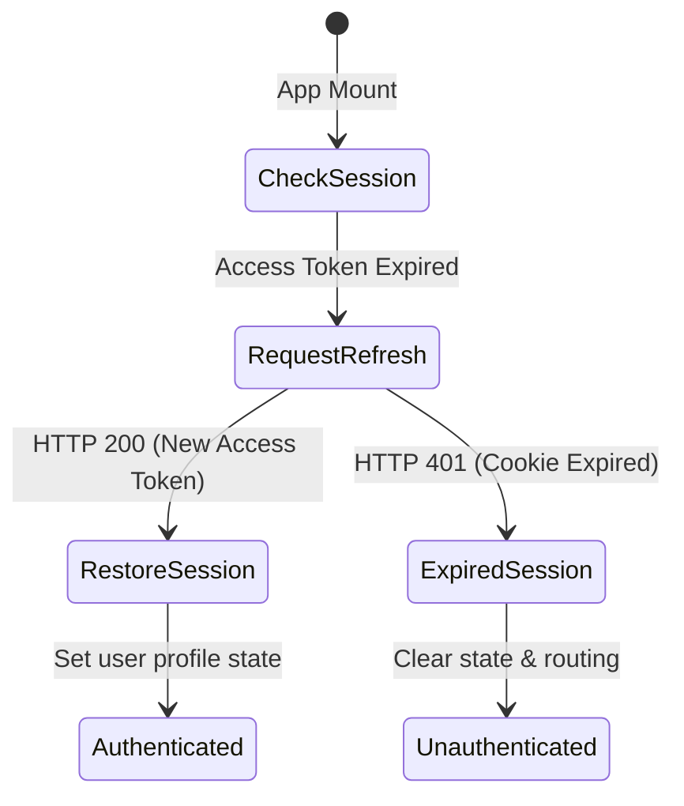

# 📁 State Management Architecture Specification
**Project**: Lynko URL Shortener Platform  

---

## 1. State Management Overview
Lynko manages application state using React Context for global configuration (such as user sessions and authentication status) combined with local page-level states for handling specific forms, queries, and filters.

---

## 2. AuthContext
The `AuthContext.jsx` provider manages authentication state:
- **Methods**: `login`, `signup`, `logout`, `checkAuthStatus`.
- **Session Restorations**: Triggers background checks to restore user sessions using rotated HTTP-Only cookies.

---

## 3. Custom Hooks
- **`useUrls`**: Manages link lists, tracking operations like creations, page transitions, search entries, and item removals.
- **`useAnalytics`**: Tracks date ranges and pagination parameters, requesting and formatting metric arrays for display.

---

## 4. Axios Interceptors
- **Request Interceptor**: Automatically injects access tokens into authentication headers.
- **Response Interceptor**: Intercepts `401 Unauthorized` responses, halts the request queue, calls `/api/auth/refresh` to rotate tokens, and retries the original request.

---

## 5. Session Restoration

---

## 6. Route Guards
- **`ProtectedRoute`**: Rejects requests if `isAuthenticated` is false, redirecting users to the login page.
- **`PublicRoute`**: Routes authenticated users away from auth pages (like Login and Signup) back to `/dashboard`.

---

## 7. URL State Management
Managed locally within components, coordinating search queries, sorting preferences, pagination indexes, and active deletion prompts.

---

## 8. Analytics State Management
Tracks date selections (`from`, `to` dates) and active page offsets to fetch and render user agent charts and click logs.

---

## 9. Bulk Upload State Management
Coordinates CSV data loading:
- **`parsedRows`**: Stores CSV raw rows.
- **`validationState`**: Stores formatting error arrays.
- **`uploadStatus`**: Tracks uploading phases (e.g. `idle`, `processing`, `success`, `error`).

---

## 10. Error State Management
Captures validation errors using Zod and maps them directly to corresponding form inputs, displaying validation status updates in real time.

---

## 11. Loading State Management
Tracks active data-fetching requests and renders loading indicators (skeletons, spinners, overlays) to maintain UI stability.

---

## 12. Request Queue Architecture
Ensures that if multiple requests fail simultaneously during an access token expiry, they are queued and retried sequentially once token rotation completes successfully.
