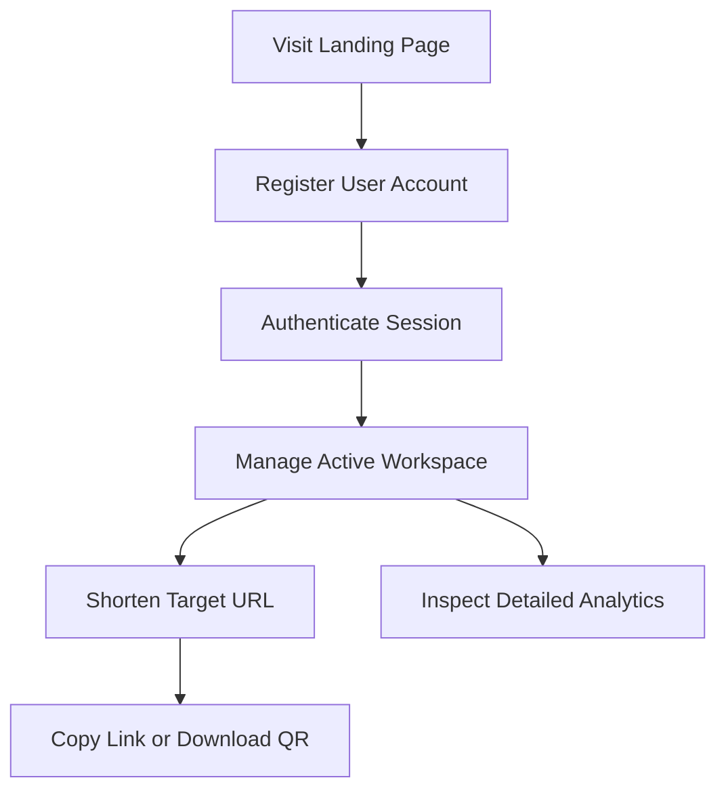

# 🎨 UI/UX Architecture Specification
**Project**: Lynko URL Shortener Platform  

---

## 1. Design Philosophy
Lynko adopts a premium **Retro-Brutalist** design style. It uses high-contrast interfaces, thick borders, solid offsets, green color scales (`#00322d`), and fluid transitions to deliver a distinct and memorable user experience.

---

## 2. Design System
- **Colors**:
  - Primary: Deep Forest Green (`#00322d`)
  - Secondary: Teal Green (`#2c6956`)
  - Background: Creamy Off-White (`#f8faf5`)
  - Accent Red: Deep Crimson (`#ba1a1a`)
- **Typography**: Inter for body copy, Space Mono for statistics, and Anton for page titles.
- **Outlines**: Thick, solid borders (`2px`) with brutalist offset active translate shifts.

---

## 3. Dashboard Shell Architecture
The `DashboardLayout.jsx` container coordinates responsive sidebars, user indicators, dynamic page headers, and toast notifications.

---

## 4. Sidebar Architecture
A persistent desktop sidebar containing link lists, user profiles, workspace configurations, and logout actions.

---

## 5. Header Architecture
A sticky header that contains the brand logo, navigation options, and status indicator components.

---

## 6. Mobile Sidebar
A slide-out menu drawer that handles navigation on mobile screens.

---

## 7. User Menu
A dropdown menu containing profile details, settings pages, and security settings.

---

## 8. Page Container
Standard layout templates with set paddings (`p-4 sm:p-6 md:p-8`) to display page charts and dashboard elements cleanly across all viewports.

---

## 9. Loading States
Uses page loading overlays and skeleton placeholders to maintain structure and visual consistency during data-fetching actions.

---

## 10. Skeleton Screens
Custom mock blocks that match the dimensions of cards, tables, and charts to keep layout structures intact when fetching data.

---

## 11. Empty States
Visual fallback layouts designed to display when search results are empty. It uses custom illustrations (such as `somnodata.png` or `dashbardnodata.png`) with clean, shadow-free styling.

---

## 12. Error States
Includes card templates with crimson brutalist borders to display connection losses or database validation issues cleanly.

---

## 13. Responsive Design
- **Flex-grid Adjustments**: Grid structures stack dynamically on mobile devices and scale into columns on larger viewports.
- **Button Sizing**: CTA buttons scale to full width on mobile viewports for easier tap targets.

---

## 14. Accessibility Considerations
- **Semantic HTML**: Standard tags (like `<nav>`, `<header>`, `<main>`, `<button>`) ensure layout structures are accessible to screen readers.
- **Interactive Element Outlines**: Visible outline focus rings for keyboard navigation.
- **Contrast Ratios**: Deep text colors (`#191c1a`) on off-white backgrounds maintain high legibility.

---

## 15. User Journey Flows

